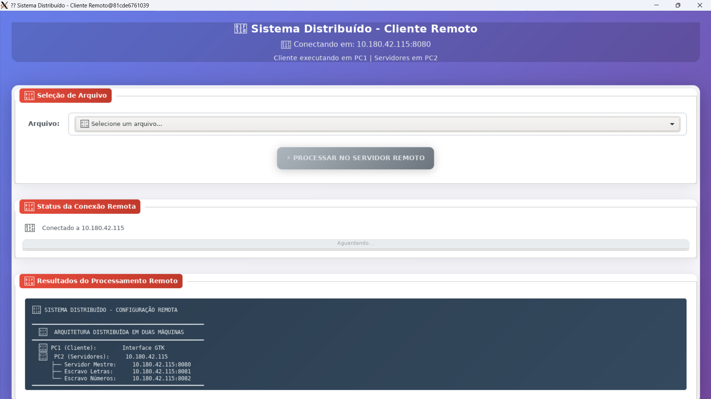
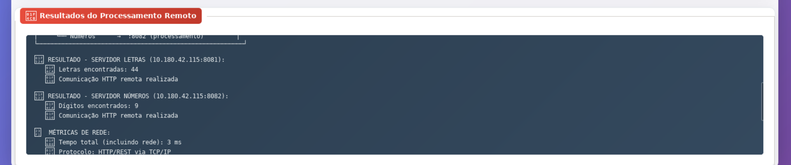
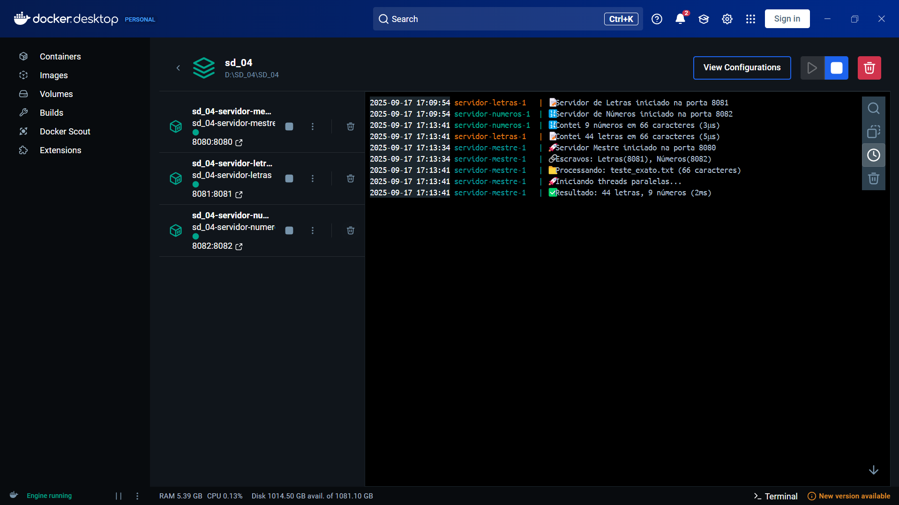
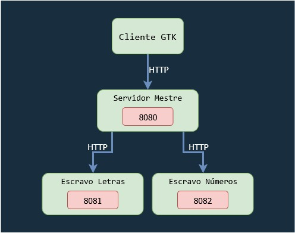

# 🚀 Sistema Distribuído Master-Slave Contador de Caracteres com C++

Sistema distribuído acadêmico implementando arquitetura **master-slave** com processamento paralelo, comunicação HTTP/REST e interface gráfica GTK moderna.

## � Resumo do Projeto

Este é um **sistema distribuído completo** que demonstra:
- ✅ **Arquitetura Master-Slave** clássica
- ✅ **Processamento paralelo** com múltiplas threads
- ✅ **Comunicação HTTP/REST** entre serviços
- ✅ **Containerização Docker** para isolamento
- ✅ **Interface gráfica GTK** moderna e responsiva
- ✅ **Distribuição de tarefas** automática

### 🎯 Funcionalidade Principal
O sistema recebe um arquivo de texto e **distribui automaticamente** o processamento:
- **Servidor Mestre** coordena toda a operação
- **Escravo de Letras** conta caracteres alfabéticos
- **Escravo de Números** conta dígitos numéricos
- **Cliente GTK** apresenta os resultados em interface moderna

---

## 📁 Estrutura Detalhada do Projeto

```
CHARACTER-COUNTER/
├── 🖥️ servidor-mestre/          # COORDENADOR PRINCIPAL
│   ├── main.cpp                 # • Recebe requisições HTTP
│   ├── CMakeLists.txt          # • Distribui tarefas para escravos
│   └── Dockerfile              # • Consolida resultados paralelos
│
├── 📝 servidor-letras/          # ESCRAVO ESPECIALIZADO
│   ├── main.cpp                 # • Conta apenas caracteres alfabéticos
│   ├── CMakeLists.txt          # • Processa em thread dedicada
│   └── Dockerfile              # • Responde via HTTP/JSON
│
├── 🔢 servidor-numeros/         # ESCRAVO ESPECIALIZADO  
│   ├── main.cpp                 # • Conta apenas dígitos numéricos
│   ├── CMakeLists.txt          # • Processa em thread dedicada
│   └── Dockerfile              # • Responde via HTTP/JSON
│
├── 🎨 cliente-gtk/              # INTERFACE GRÁFICA MODERNA
│   ├── main_compativel.cpp     # • Interface GTK3 com CSS styling
│   └── Dockerfile              # • Seleção de arquivos intuitiva
│                                # • Visualização de resultados
│
├── ⚙️ docker-compose.yml        # ORQUESTRAÇÃO COMPLETA
├── ▶️ executar-gtk-compativel.bat # SCRIPT DE EXECUÇÃO AUTOMÁTICA
├── 📄 exemplo.txt               # ARQUIVO DE TESTE INCLUÍDO
└── 📖 README.md                 # ESTA DOCUMENTAÇÃO
```

---

## 🚀 Como Executar o Sistema

### 📋 Pré-requisitos Obrigatórios

1. **Docker Desktop** instalado e rodando
2. **XLaunch/VcXsrv** para interface gráfica no Windows
   - Download: https://sourceforge.net/projects/vcxsrv/
   - Configurar com: `-ac -terminate -lesspointer -multiwindow -clipboard`

### ⚡ Execução Automática (Recomendado)

```cmd
# Executar o script completo (faz tudo automaticamente)
executar-gtk-compativel.bat
```

### 🔧 Execução Manual (Passo a Passo)

```cmd
# 1. Construir as imagens Docker
docker-compose build

# 2. Iniciar todos os serviços em background
docker-compose up -d

# 3. Aguardar inicialização (5 segundos)
timeout /t 5

# 4. Verificar se serviços estão rodando
docker-compose ps

# 5. Executar cliente GTK (interface gráfica)
set DISPLAY=host.docker.internal:0
docker run --rm -it -e DISPLAY=%DISPLAY% -v "%cd%:/home/arquivos" --network sd04_distributed_system cliente-gtk

# 6. Para encerrar todos os serviços
docker-compose down
```
---

## 📸 Telas do Sistema

### 🖥️ Interface do Cliente GTK


### 📊 Resultados do Processamento Remoto


### 🐳 Containers em Execução (Docker Desktop)


---

---

## 🏗️ Arquitetura Técnica Detalhada

### 🌐 Diagrama de Comunicação

```

### ⚙️ Fluxo de Processamento

1. **📤 Cliente** envia arquivo via interface GTK
2. **🖥️ Mestre** recebe requisição HTTP com JSON
3. **🧵 Threads Paralelas** são criadas automaticamente:
   - Thread A → chama Escravo de Letras
   - Thread B → chama Escravo de Números
4. **📝🔢 Escravos** processam suas partes simultaneamente
5. **🔄 Mestre** aguarda ambas as respostas
6. **📊 Resultado** é consolidado e retornado
7. **🎨 Interface** exibe resultados formatados

### 🐳 Containers Docker

| Container | Porta | Função | Tecnologias |
|-----------|-------|---------|-------------|
| `servidor-mestre` | 8080 | Coordenação | C++17, cpp-httplib, std::async |
| `servidor-letras` | 8081 | Contagem letras | C++17, cpp-httplib |
| `servidor-numeros` | 8082 | Contagem números | C++17, cpp-httplib |
| `cliente-gtk` | - | Interface gráfica | GTK3, CSS, Docker |

---

## 📡 Especificações Técnicas

### 💻 Tecnologias Utilizadas

- **Linguagem**: C++17 (std::thread, std::async, std::future)
- **Interface**: GTK3 com CSS styling personalizado  
- **HTTP**: cpp-httplib (cliente e servidor REST)
- **JSON**: nlohmann/json para serialização
- **Containerização**: Docker + Docker Compose
- **Rede**: Bridge network isolada
- **Sistema Operacional**: Ubuntu 20.04 nos containers

### 🔧 Endpoints da API

| Endpoint | Método | Descrição | Payload |
|----------|--------|-----------|---------|
| `/processar` | POST | Processa arquivo no mestre | `{"nome_arquivo": "...", "conteudo": "..."}` |
| `/letras` | POST | Conta caracteres alfabéticos | `{"conteudo": "..."}` |
| `/numeros` | POST | Conta dígitos numéricos | `{"conteudo": "..."}` |
| `/saude` | GET | Verifica status do serviço | - |

### � Exemplo de Resposta JSON

```json
{
  "nome_arquivo": "exemplo.txt",
  "letras": 245,
  "numeros": 67,
  "tempo_ms": 142,
  "status": "sucesso"
}
```

---

## 🎯 Características Acadêmicas Implementadas

### ✅ Sistemas Distribuídos
- [x] **Master-Slave** com coordenação centralizada
- [x] **Comunicação por mensagens** (HTTP/REST)
- [x] **Tolerância a falhas** com health checks
- [x] **Paralelismo** com threads assíncronas
- [x] **Isolamento** via containers Docker

### ✅ Programação Concorrente
- [x] **std::async** para processamento paralelo
- [x] **std::future** para sincronização
- [x] **Thread safety** nas operações HTTP
- [x] **Non-blocking calls** entre serviços

### ✅ Interface de Usuário
- [x] **GTK3** com design moderno
- [x] **CSS styling** responsivo
- [x] **Feedback visual** em tempo real
- [x] **Tratamento de erros** na interface

---

## 🔍 Testando o Sistema

### 📁 Arquivos Suportados
O sistema processa qualquer arquivo texto com extensões:
- `.txt` - Arquivos de texto simples
- `.cpp` - Código-fonte C++
- `.log` - Arquivos de log
- `.md` - Documentação Markdown

### 🧪 Teste de Exemplo
1. Use o arquivo `exemplo.txt` incluído
2. Execute o sistema
3. Selecione o arquivo na interface
4. Clique "PROCESSAR ARQUIVO"
5. Veja os resultados detalhados

### 📈 Métricas Exibidas
- **Total de letras** processadas pelo escravo especializado
- **Total de números** processadas pelo escravo especializado  
- **Tempo de processamento** em milissegundos
- **Status da comunicação** HTTP entre serviços

---

## 🛠️ Solução de Problemas

### ❌ Container não inicia
```bash
# Verificar logs
docker-compose logs servidor-mestre
docker-compose logs servidor-letras
docker-compose logs servidor-numeros
```

### ❌ Interface não abre
```bash
# Verificar XLaunch rodando
tasklist | findstr vcxsrv

# Reiniciar XLaunch se necessário
```

### ❌ Erro de rede
```bash
# Recriar containers
docker-compose down
docker-compose up -d --force-recreate
```

---

## 👨‍💻 Desenvolvimento e Compilação

### 🔨 Build Manual dos Servidores
```bash
# Em cada pasta de servidor
mkdir build && cd build
cmake ..
make
```

### 🐳 Build das Imagens Docker
```bash
# Build individual
docker build -t servidor-mestre ./servidor-mestre
docker build -t servidor-letras ./servidor-letras  
docker build -t servidor-numeros ./servidor-numeros
docker build -t cliente-gtk ./cliente-gtk

# Build completo
docker-compose build --no-cache
```

---

**🎓 Projeto Acadêmico - Sistemas Distribuídos**  
*Implementação completa de arquitetura master-slave com interface gráfica moderna*

